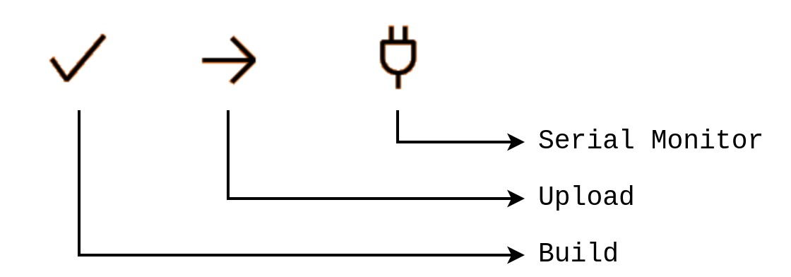
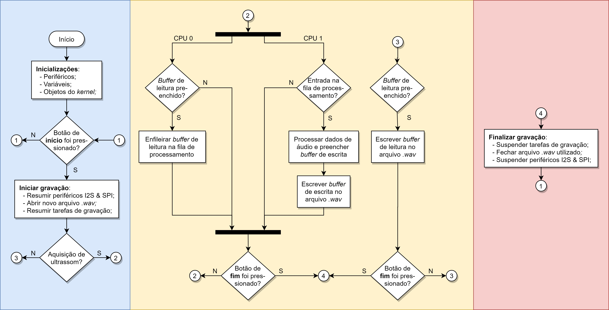
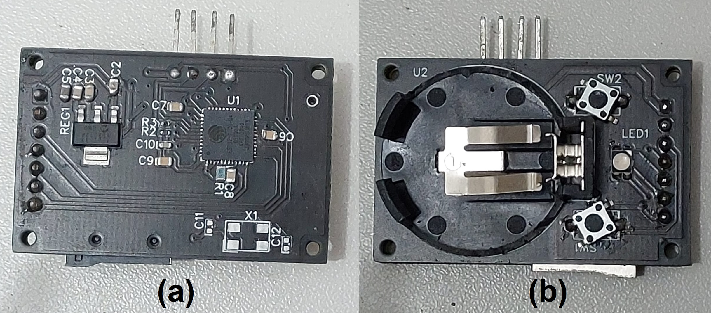

# Sistema embarcado portátil para aquisição de áudio ultrassônico em roedores

O projeto contido neste repositório diz respeito a um sistema de aquisição de áudio ultrassônico compacto, portátil e economicamente viável que utiliza, principalmentel um microfone micro-eletro-mecânico (MEMS) ultrassônico de pequenas dimensões para aquisição de áudio, um cartão micro SD para armazenamento em massa do áudio processado e o microcontrolador ESP32 para interfaceamento entre os periféricos.

## Árvore de diretórios

O repositório possui a seguinte árvore de diretórios:

```sh
📦mems2sd_esp32
 ┣ 📂data # contém dados de áudio coletados em testes executados em etapas iniciais do projeto
 ┃ ┣ 📂Old data
 ┃ ┣ 📂Real clock tests
 ┃ ┣ 📂Sampling rate tests
 ┣ 📂demo # projetos de demonstração para testes simples com os periféricos do esp32
 ┃ ┣ 📂HC-SR04 #sensor de proximidade ultrassônico
 ┃ ┣ 📂I2S # I2S em modo PDM
 ┃ ┣ 📂I2S_RX # I2S em modo padrão como receptor controlador
 ┃ ┣ 📂I2S_TX # I2S em modo padrão como transmissor periférico
 ┃ ┣ 📂LED # acionamento de LED RGB
 ┃ ┗ 📂SD # sistema de arquivos do cartão SD
 ┣ 📂firmware # projetos principais do firmware do sistema
 ┃ ┣ 📂pure_i2s_acquisition # aquisição com conversão PDM2PCM por hardware
 ┃ ┣ 📂single_bit_pdm_acquisition # aquisição com conversão PDM2PCM por software
 ┃ ┗ 📂ultrasound_acquisition # projeto principal com aquisição em modo padrão e ultrassônico
 ┣ 📂misc # documentação
 ┣ 📂python # testes dos algoritmos de processamento de sinais em python
 ┃ ┣ 📂BitDepthComparison # teste de comparação da resolução de bits para aquisição de USVs
 ┃ ┣ 📂ChunksProcessing # geração de espectrograma com biblioteca PyChronux em chunks
 ┃ ┣ 📂PDMSignalProcessing # algoritmos e testes de conversão PDM2PCM por software
 ┃ ┣ 📂SamplingRateTests # testes de taxa de amostragem
 ┃ ┣ 📂StdUltTests # processamento de sinal de áudio PCM
 ┃ ┗ 📂SyntheticAudio # geração sintética de áudio para testes
 ┣ 📂snippets # trechos de código que não formam projeto
 ┃ ┣ 📂GPIO
 ┃ ┣ 📂SD
 ┃ ┣ 📂WAV
 ┃ ┗ 📂freeRTOS management
```

Apesar do firmware e projetos de demonstração terem sido desenvolvidos de acordo com a estrutura de projeto do PlatformIO, seu código fonte pode ser adaptado para ser utilizado em um projeto do ESP-IDF, exceto para aqueles que expressamente usam o framework do Arduino (verificar arquivo `platformio.ini` de cada projeto para mais detalhes). 

## Funcionamento

### Preparando o firmware

O projeto a ser compilado e carregado no protótipo é o `/firmware/ultrasound_acquisition`, pois contém a versão mais atualizada do firmware. O PlatformIO pode ser utilizado para compilar e carregar o binário de execução sem a necessidade de configurar a o ESP-IDF. A interface por linha de comando do PlatformIO pode ser instalada usando o gerenciador de pacotes `pip`:

```
$ pip install platformio
```

É ideal que o caminho do Python e seus scripts esteja no PATH do sistema, assim os comandos do PlatformIO podem ser facilmente invocados pelas aliases `platformio` ou `pio`.

Uma vez localizada a pasta do projeto do firmware (pasta raix do projeto onde se encontra o arquivo `platformio.ini`), compile o binário com o seguinte comando:

```
$ platformio run -e esp32dev
```

O argumento `-e` ou `--environment` diz respeito à placa utilizada (e.g. `esp32dev`, `lolin32`, etc.) e é definido pela variável `board` no arquivo `platformio.ini`. Por padrão o *chip* utilizado no protótipo deste produto suporta a placa `esp32dev` sem problemas, assim não há necessidade de modificar o comando acima.

Após a compilação terminar com sucesso, carregue o binário no ESP32 com o seguinte comando:

```
$ platformio run -t upload
```

Durante o carregamento do binário o botão de **boot** deve ser mantido pressionado.

Para verificar o funcionamento do sistema, o monitor serial pdoe ser invocado com o comando:

```
$ platformio device monitor -b 115200
```

A velocidade de comunicação da porta serial (argumento `-b` ou `--baud` de *baud rate*) deve ser definida de acordo com o valor configurado no `platformio.ini` para a variável `monitor_speed`, i.e. 115200bps.

O PlatformIO também possui uma IDE que pode ser facilmente baixada como uma extensão do vscode. Dessa forma os comandos acima seriam abstraídos por botões localizados na barra de *status* do vscode. A funcionalidade dos botões mais importantes estão descritas na Figura 1.

<p align="center">
Figura 1 - Botões da IDE do PlatformIO no vscode.
</p>

<p align="center">
    
</p>

### Operando o sistema

Pode ser observado na Figura 2 e 3 o fluxograma que descreve o funcionamento do firmware e a PCB do protótipo do sistema, respectivamente. No protótipo, o switch SW1 possui a função de reset e o switch SW2 possui função de **boot** durante o carregamento do binário e função de **início/fim** (como indicado no fluxograma) da gravação do sistema de aquisição durante seu funcionamento.


<p align="center">
Figura 2 - Fluxograma do funcionamento do firmware.
</p>

<p align="center">
    
</p>

<p align="center">
Figura 3 - Protótipo do sistema de aquisição.
</p>

<p align="center">
    
</p>

O sistema deve ter um cartão micro SD conectado para o correto funcionamento. Além disso o cartão deve conter um arquivo mandatório nomeado `config.txt` para inicializar algumas configuração básica do sistema. Esse arquivo possui as seguintes opções de preenchimento:

- O campo `record_file_name_sufix` (numérico) funciona como sufixo para o nome do arquivo de áudio de saída. Apesar disso, a cada nova sessão de gravação o sistema soma 1 a esse valor para segmentar cada sessão em arquivos diferentes. Futuramente este campo pode ser utilizado como uma lista de strings para nomear os arquivos de áudio de uma forma mais complexa;
- O campo `sampling_rate` (numérico) funciona, atualmente, como um placeholder para uma futura implementação de uma taxa de amostragem ajustável;
- O campo `bit_depth` (numérico) funciona, atualmente, como um placeholder para uma futura implementação de uma resolução de bits ajustável do áudio de saída;
- O campo `record_session_duration` (numérico) pode ser utilizado para demarcar a duração, em segundos, de uma sessão de gravação e, caso seja atribuído o valor `-1`, o firmware não vai temporizar a duração das gravações;
- O campo `interval_between_record_session` (numérico) pode ser utilizado para demarcar a duração, em segundos dos intervalos entre sessões de gravação e, caso seja atribuído o valor `-1`, o firmware não vai temporizar os intervalos entre gravações;
- O campo `ultrasound_mode` (booleano) é utilizado para indicar o modo de aquisição do áudio, sendo o modo padrão quando 0 e o modo ultrassônico quando 1. Estão fixadas no firmware as taxas de amostragem de 98ksps para o modo padrão e 312.5ksps para o modo ultrassônico;
- O campo `recording_color` (numérico) indica a cor que o LED RGB deve apresentar durante uma sessão de gravação (pode ser usado para indicar, de maneira única, os ratinhos), as cores possíveis são indicadas pela enumeração `colors_t` descrita em `led_driver.h`:
```c
typedef enum {
    OFF_COLOR=0, 
    RED_COLOR=1, 
    GREEN_COLOR=2, 
    BLUE_COLOR=3, 
    MAGENTA_COLOR=4, 
    YELLOW_COLOR=5, 
    CYAN_COLOR=6, 
    WHITE_COLOR=7} colors_t;
```

Mesmo que a duração da gravação ou intervalo entre gravações seja definido (maior que `-1`), a sessão ainda pode ser iniciada/terminada por meio do switch SW2.

As cores do LED podem estar desconfiguradas a depender da versão do protótipo. Porém, espera-se que o sistema assuma as seguintes cores padrão de acordo com o posição no firmware:

- `WHITE_COLOR` durante as inicializações do sistema;
- `BLUE_COLOR` durante o estado de espera para uma gravação;
- `GREEN_COLOR` durante o curto período de iniciação de uma gravação;
- `OFF_COLOR` (padrão) durante a sessão de gravação, porém essa cor pode ser configurada no arquivo `config.txt`;
- `RED_COLOR` durante o curto período de finalização de uma gravação;

Abaixo está apresentada uma estrutura padrão para o arquivo `config.txt`:

```s
record_file_name_sufix=42;
sampling_rate=8000;
bit_depth=16;
record_session_duration=-1;
interval_between_record_session=-1;
recording_color=0;
ultrasound_mode=0;
```

Neste exemplo nota-se que a duração das sessões de gravação e os intervalos entre gravações não serão temporizados; durante a gravação o LED assumirá o estado apagado (`OFF_COLOR`); e o áudio será adquirido na faixa audível.

Ao final do uso do sistema, os arquivos de áudio podem ser obtidos do cartão SD no formato `.wav` e com os metadados já configurados pelo sistema.

